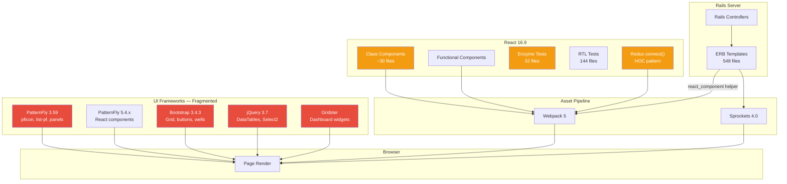
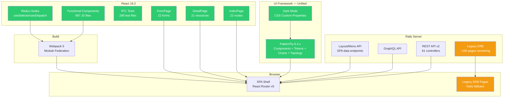
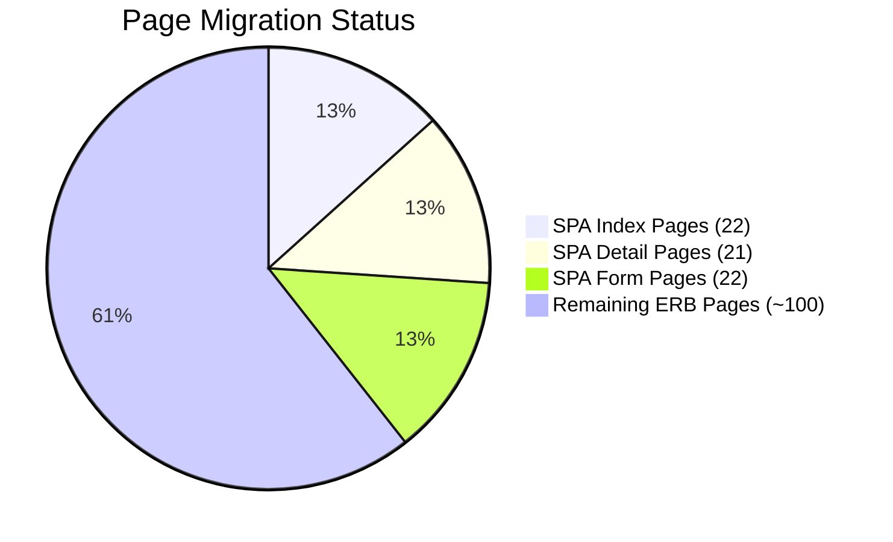
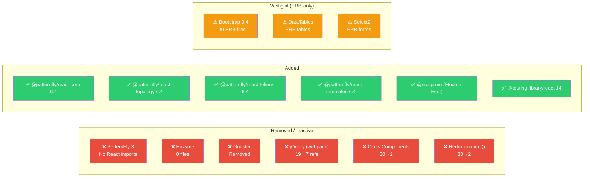
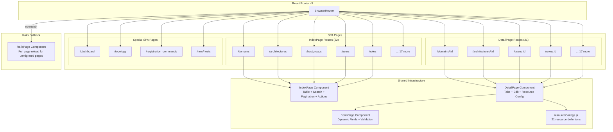
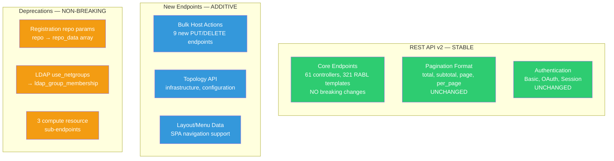
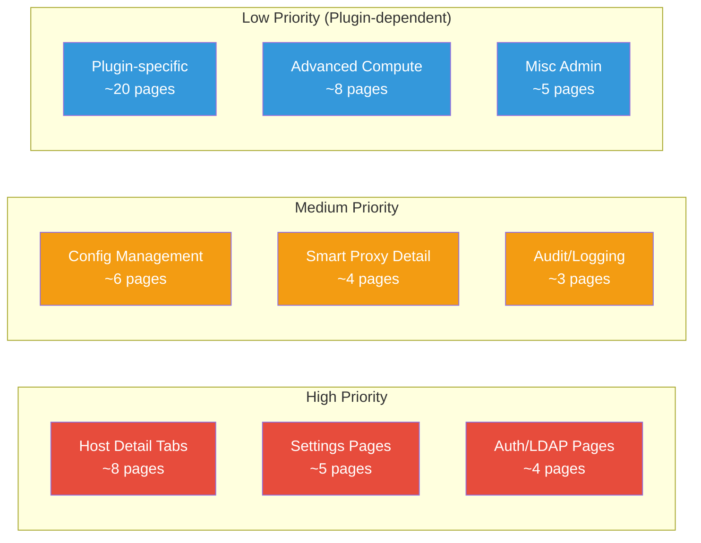
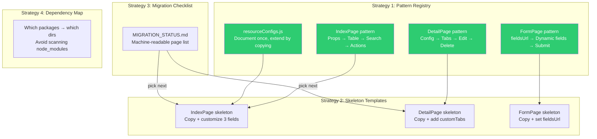

# Foreman PF6 Upgrade — Before & After Analysis Report

> Generated: 2026-06-22 | Branch: `develop`

---

## Table of Contents

1. [Executive Summary](#1-executive-summary)
2. [Technology Stack Comparison](#2-technology-stack-comparison)
3. [Architecture Diagrams](#3-architecture-diagrams)
4. [Migration Progress](#4-migration-progress)
5. [CLI & API Compatibility](#5-cli--api-compatibility)
6. [Remaining Work](#6-remaining-work)
7. [AI-Driven Development Roadmap](#7-ai-driven-development-roadmap)

---

## 1. Executive Summary

The Foreman frontend has undergone a major modernization across **14+ phases**, transforming from a fragmented multi-framework jQuery/Bootstrap/PF3/PF5/React16 codebase into a unified PatternFly 6 + React 18 SPA-capable application.

### Key Outcomes

| Metric | Before | After | Improvement |
|--------|--------|-------|-------------|
| UI framework versions in use | 3 (PF3 + PF5 + Bootstrap) | 1 (PF6) | **Unified** |
| React version | 16.9 | 18.2.0 | +2 major versions |
| jQuery dependencies in webpack | 19+ files | 7 refs (mostly legacy) | -63% |
| Class components | ~30+ files | 2 (ErrorBoundary only) | **~100% functional** |
| Redux connect() HOCs | 30+ files | 2 (legacy edge cases) | **Hooks-based** |
| Enzyme test files | 32 | 0 | **RTL only** |
| Dark mode | None | Full toggle | **New capability** |
| SPA pages | 0 | 22 index + 21 detail + 22 forms | **65 SPA routes** |
| PF6 component imports | 0 | 272 files | **Primary UI framework** |

### Unification Assessment

**Before:** The codebase required knowledge of 5+ UI frameworks to make changes. A developer touching a page might encounter Bootstrap grid classes, PF3 icons, PF5 components, jQuery plugins, and raw SCSS — all on the same page.

**After:** New React pages use exactly one pattern: PF6 components + Redux hooks + React Router. The remaining ~100 ERB pages still load Bootstrap/PF3 CSS but these are legacy pages awaiting migration, not new development.

---

## 2. Technology Stack Comparison

### 2A. Core Framework Matrix

| Category | Before (pre-PF6) | After (current) | Status |
|----------|------------------|-----------------|--------|
| **React** | 16.9 | 18.2.0 | Done |
| **PatternFly CSS** | 3.59 + 5.4.x | 6.4.0 | Done |
| **PatternFly React** | 5.4.x | 6.4.3 | Done |
| **PatternFly Charts** | 7.x (Victory) | 8.4.1 (Victory) | Done |
| **PatternFly Topology** | — | 6.4.0 | New |
| **Bootstrap** | 3.4.3 (active, 100+ ERB pages) | 3.4.3 (vestigial, ERB-only) | Partial |
| **jQuery** | Active in 19+ webpack files | ~7 refs (comments/legacy) | Done |
| **DataTables** | Active | Vestigial (ERB-only) | Partial |
| **Select2** | Active | Vestigial (ERB-only) | Partial |
| **Gridster** | Dashboard widget system | Removed (PF6 Card grid) | Done |

### 2B. Component & State Management

| Category | Before | After | Status |
|----------|--------|-------|--------|
| **Components** | Class + functional mixed | 100% functional (2 ErrorBoundary exceptions) | Done |
| **State management** | Redux connect() HOC | Redux hooks (useSelector/useDispatch) | Done |
| **Redux toolkit** | Partial | @reduxjs/toolkit 1.6 | Done |
| **Forms** | Formik + ERB forms | Formik + PF6 FormPage component | Done |
| **Routing** | Rails-driven + partial React Router | React Router v5 SPA + Rails fallback | In progress |
| **i18n** | react-intl 2.8 | react-intl 2.8 (unchanged) | — |
| **GraphQL** | Apollo Client 3.x | Apollo Client 3.x (unchanged) | — |

### 2C. Build & Testing

| Category | Before | After | Status |
|----------|--------|-------|--------|
| **Bundler** | Webpack 5 | Webpack 5 (unchanged) | — |
| **CSS preprocessor** | SCSS + Bootstrap vars | SCSS + PF6 design tokens | Done |
| **CSS custom properties** | ~0 | 68+ uses of `--pf-v6-*` | Done |
| **Test framework** | Enzyme (32 files) + RTL (144 files) | RTL only (280 test files) | Done |
| **TypeScript** | Configured, 0 files | Configured, 0 files | Future |
| **Node version** | >=14 | >=22 | Done |
| **Plugin federation** | @theforeman/vendor | @scalprum (Module Federation) | Done |

### 2D. CSS & Design System

| Category | Before | After | Status |
|----------|--------|-------|--------|
| **Design tokens** | None | @patternfly/react-tokens 6.4.0 | Done |
| **Dark mode** | Not possible | Full (toggle + localStorage) | Done |
| **Sidebar colors** | Custom blue (#024d6c) overrides | PF6 native token-based | Done |
| **Navigation** | Accordion (single-expand) | Multi-expand sidebar | Done |
| **Icons** | pficon (PF3) + @patternfly/react-icons | @patternfly/react-icons only | Done |
| **SCSS files** | 67 | 67 (refactored, not reduced) | — |

---

## 3. Architecture Diagrams

### 3A. Before: Multi-Framework Architecture



### 3B. After: Unified PF6 Architecture



### 3C. Migration Progress Overview



### 3D. Dependency Cleanup



### 3E. SPA Routing Architecture



---

## 4. Migration Progress

### 4A. Phase Completion Timeline

| Phase | Description | Status |
|-------|-------------|--------|
| **0** | React 16 → 18, remove PF3 dependencies | Done |
| **1.1–1.5** | Replace deprecated PF5 components, class→functional, connect()→hooks | Done |
| **2.1–2.5** | PatternFly 5.4.x → 6.4.x upgrade | Done |
| **2.6–2.11** | Migrate deprecated Modal API | Done |
| **4.6–4.10** | PF6 native sidebar, dark mode toggle, multi-expand nav | Done |
| **4.11** | Dashboard redesign (Gridster → PF6 Cards) | Done |
| **5** | Reusable IndexPage infrastructure | Done |
| **6A–6G** | Migrate 22 ERB index pages to React IndexPage | Done |
| **7.1–7.4, 7D** | FormPage infrastructure + 22 forms migrated | Done |
| **8** | Remove jQuery from 19 webpack files, convert error pages & modals | Done |
| **9** | Register 22 index pages as React Router SPA routes | Done |
| **11.1–11.4** | Unified DetailPage with resource config registry | Done |
| **12** | Topology Visualization (PF Topology extension) | Done |
| **13–14** | SPA detail page parity (tabs, filters, external groups) | Done |

### 4B. Page Migration Scorecard

| Page Type | Migrated | Total (est.) | % Complete | Reusable Component |
|-----------|----------|-------------|------------|-------------------|
| Index pages | 22 | ~35 | **63%** | `IndexPage` |
| Detail pages | 21 | ~30 | **70%** | `DetailPage` |
| Form pages | 22 | ~40 | **55%** | `FormPage` |
| Dashboard | 1 | 1 | **100%** | Custom |
| Topology | 1 | 1 | **100%** | Custom |
| Registration | 1 | 1 | **100%** | Custom |

### 4C. Codebase Metrics

| Metric | Count |
|--------|-------|
| Total JS files (webpack) | 987 |
| Test files (.test.js) | 280 |
| SCSS files | 67 |
| Files importing @patternfly | 272 |
| Files using Redux hooks | 70 |
| ERB templates total | 548 |
| ERB files using react_component | 108 |
| ERB files with Bootstrap classes | 100 |
| API v2 controllers | 61 |
| RABL API templates | 321 |

---

## 5. CLI & API Compatibility

### 5A. API Stability Assessment



### 5B. Hammer CLI Compatibility

| Area | Impact | Risk | Action Required |
|------|--------|------|-----------------|
| Core CRUD endpoints | None — all v2 endpoints preserved | **None** | No changes needed |
| List/search/pagination | Format unchanged (total, subtotal, page, per_page) | **None** | No changes needed |
| Host power management | New bulk endpoints added | **None** | Optional: add bulk support |
| Registration | `repo`/`repo_gpg_key_url` deprecated (still works) | **Low** | Update to `repo_data[]` format when ready |
| LDAP auth source | `use_netgroups` deprecated (still works) | **Low** | Update to `ldap_group_membership` |
| Compute resources | 3 sub-endpoints deprecated | **Low** | Update when endpoints are removed |
| Topology | New endpoints | **None** | Optional: add topology commands |

**Verdict: Hammer CLI will continue working without any changes.** Deprecated parameters still function and only log warnings. No endpoint signatures have changed.

### 5C. New Endpoints (additive, non-breaking)

| Method | Endpoint | Purpose |
|--------|----------|---------|
| GET | `/layout` | SPA layout data (sidebar, taxonomy switcher) |
| GET | `/menu` | User menu structure for SPA |
| DELETE | `/api/v2/hosts/bulk/` | Bulk delete hosts |
| PUT | `/api/v2/hosts/bulk/assign_organization` | Bulk assign org |
| PUT | `/api/v2/hosts/bulk/assign_location` | Bulk assign location |
| PUT | `/api/v2/hosts/bulk/build` | Bulk build hosts |
| PUT | `/api/v2/hosts/bulk/change_owner` | Bulk change owner |
| PUT | `/api/v2/hosts/bulk/change_power_state` | Bulk power control |
| PUT | `/api/v2/hosts/bulk/disassociate` | Bulk disassociate |
| PUT | `/api/v2/hosts/bulk/manage_notifications` | Bulk notifications |
| PUT | `/api/v2/hosts/bulk/update_parameters` | Bulk parameter update |
| PUT | `/api/v2/hosts/bulk/reassign_hostgroup` | Bulk reassign hostgroup |
| GET | `/api/v2/topology/infrastructure` | Topology visualization data |
| GET | `/api/v2/topology/configuration` | Configuration topology data |

### 5D. Behavioral Changes

| Change | Detail | Risk | Who's Affected |
|--------|--------|------|----------------|
| `global_status` dynamic | Computed at request time, not cached | **Low** | API consumers expecting cached status |
| SPA URL patterns | React pages use client-side routing | **None** | API is unchanged; only browser navigation |
| Detail page URLs | SPA detail pages at `/new/{resource}/{id}` pattern | **Medium** | Bookmarks, external links, documentation |
| GraphQL | Unchanged (v1.13, POST `/api/graphql`) | **None** | GraphQL consumers |

### 5E. Plugin API Impact

| Area | Impact |
|------|--------|
| Plugin REST API registration | **Unchanged** — plugins register via `Foreman::Plugin` |
| Plugin GraphQL extensions | **Unchanged** — `realize_plugin_query_extensions` intact |
| Plugin UI via Module Federation | **Changed** — plugins should use @scalprum instead of @theforeman/vendor |
| Plugin ERB views | **Unchanged** — still rendered, can use legacy CSS |
| Plugin apipie documentation | **Unchanged** — apipie-rails intact |

---

## 6. Remaining Work

### 6A. Legacy Dependencies to Remove

| Dependency | npm Package | Blocking Factor | Removal Condition |
|-----------|------------|-----------------|-------------------|
| PatternFly 3 | `patternfly@3.59.5` | ERB pages load PF3 CSS globally | Migrate remaining ERB pages |
| Bootstrap 3 | `bootstrap-sass@3.4.3` | 100 ERB files use Bootstrap grid/components | Migrate remaining ERB pages |
| jQuery | `jquery@3.7.1` | DataTables, Select2, legacy ERB JS | Migrate remaining ERB pages |
| DataTables | `datatables.net@1.13.5` | ERB table pages | Migrate to IndexPage |
| Select2 | `select2@4.0.12` | ERB form selects | Migrate to PF6 Select |
| jquery-ujs | `jquery-ujs@1.2.0` | Rails UJS for ERB forms | Migrate to React forms |

### 6B. Unmigrated ERB Page Categories



### 6C. Technical Debt Summary

| Item | Severity | Effort |
|------|----------|--------|
| Remove PF3/Bootstrap from npm deps | Low | After ERB migration |
| Adopt TypeScript (987 JS files) | Low | Gradual, optional |
| Upgrade React Router v5 → v6 | Medium | Significant, deferred |
| Upgrade react-intl v2 → v6 | Low | Moderate refactor |
| Consolidate SCSS (67 files) | Low | Gradual |

---

## 7. AI-Driven Development Roadmap

### 7A. Per-Directory CLAUDE.md Files

Create context-minimizing documentation in key directories so AI agents can work effectively with minimal file reads:

| Directory | Purpose | Key Content |
|-----------|---------|-------------|
| `webpack/assets/javascripts/react_app/` | React app root | Architecture, entry points, store shape, component registration |
| `webpack/.../components/` | Component library | Naming conventions, SCSS co-location, prop patterns, test patterns |
| `webpack/.../components/common/` | Shared infrastructure | IndexPage, DetailPage, FormPage — how to use and extend |
| `webpack/.../routes/` | SPA routing | How to add routes, resource configs, lazy loading |
| `webpack/.../redux/` | State management | Slice patterns, selectors, API middleware, action naming |
| `app/controllers/api/v2/` | REST API | Controller base class, pagination, search, RABL templates |
| `app/views/` | ERB templates | Which are legacy, which mount React, migration status |

### 7B. Claude Code Skills to Create

| Skill | Purpose | When to Use |
|-------|---------|-------------|
| `migrate-erb-to-react` | Convert ERB index/show/form to React SPA using established patterns | "migrate X page to React" |
| `add-spa-route` | Register a new React page as SPA route with resource config | "add SPA route for X" |
| `pf6-component-check` | Audit a file for deprecated PF patterns, suggest PF6 replacements | "check PF6 compliance" |
| `test-coverage` | Generate RTL tests following project patterns | "add tests for X component" |
| `api-endpoint-audit` | Verify API endpoint compatibility and document changes | "audit API for X" |

### 7C. Context Minimization Strategies



#### Key Insight: The Resource Config Pattern

The single most impactful optimization for AI development is documenting the `resourceConfigs.js` pattern. Adding a new SPA-ready resource requires only:

1. Create an `XxxIndex` component (copy existing pattern)
2. Add a route to `IndexPages/index.js` (one `route()` call)
3. Add a config to `DetailPages/resourceConfigs.js` (one object)

This is a **3-file, ~50-line change** to add full CRUD SPA support for any resource — an ideal target for AI automation.

### 7D. Recommended Next Steps (Priority Order)

1. **Create CLAUDE.md files** (7 directories) — immediate ROI for AI context
2. **Create MIGRATION_STATUS.md** — machine-readable tracking of remaining work
3. **Build `migrate-erb-to-react` skill** — automate the most repetitive remaining task
4. **Build `add-spa-route` skill** — 3-file pattern, perfect for automation
5. **Document resourceConfigs pattern** in detail — the key abstraction for all new pages
6. **Create component skeleton templates** — reduce AI "thinking" overhead per migration

---

## Appendix A: File Counts by Directory

```
webpack/assets/javascripts/react_app/
├── components/         # 290 directories, ~700 JS files
│   ├── common/         # IndexPage, DetailPage, FormPage, Pagination, etc.
│   ├── Dashboard/      # SPA dashboard
│   ├── Hosts*/         # Host management components
│   ├── Layout/         # Sidebar, Header, ThemeToggle
│   └── ...             # 60+ domain components
├── routes/             # SPA route definitions
│   ├── IndexPages/     # 22 index routes
│   └── DetailPages/    # 21 detail configs
├── redux/              # 59 Redux modules
└── common/             # Shared utilities, I18n, API helpers
```

## Appendix B: Package.json Key Versions

| Package | Version | Category |
|---------|---------|----------|
| react | 18.2.0 | Core |
| react-dom | 18.2.0 | Core |
| react-router | 5.3.4 | Routing |
| redux | 4.0.4 | State |
| @reduxjs/toolkit | 1.6.0 | State |
| @patternfly/react-core | ~6.4.3 | UI |
| @patternfly/patternfly | ~6.4.0 | CSS |
| @patternfly/react-table | ~6.4.3 | UI |
| @patternfly/react-charts | ~8.4.1 | Charts |
| @patternfly/react-topology | ~6.4.0 | Visualization |
| @patternfly/react-tokens | ~6.4.0 | Design tokens |
| @apollo/client | 3.3.7 | GraphQL |
| webpack | 5.75.0 | Build |
| jest | 26.4.0 | Test |
| @testing-library/react | 14.0.0 | Test |
| formik | 1.5.8 | Forms |
| sass | 1.60.0 | CSS |
| typescript | 5.8.2 | Future |
